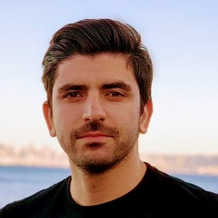

---
# You don't need to edit this file, it's empty on purpose.
# Edit theme's home layout instead if you wanna make some changes
# See: https://jekyllrb.com/docs/themes/#overriding-theme-defaults

layout: default
---

I received my Ph.D. in Computer Engineering from the Department of Computer and Electrical Engineering and Computer Science, Florida Atlantic University. My main research interests are **Post-Quantum Cryptography** and **Homomorphic Encryption**. In particular, I am working on highly-optimized implementation of cryptography protocols on various platforms.  
During my doctoral research, I was conducting research with a focus on the Post-Quantum Isogeny-based Cryptography at the [Institute for Sensing and Embedded Network Systems Engineering (ISENSE)](http://isense.fau.edu/).   
During summer 2017-2018, I was working as a Research Intern with [Cryptography Research Group](https://www.microsoft.com/en-us/research/group/cryptography-research/) at Microsoft Research, under the supervison of [Kristin Lauter](https://www.microsoft.com/en-us/research/people/klauter/) and [Kim Laine](https://www.microsoft.com/en-us/research/people/kilai/).   
In summer 2018-2019, I did an internship as a Security Software Engineer with Security Group at LinkedIn Corporation under supervision of Neil Davenport and Tushar Dalvi.
     
* * *

# Employment

##### (2018) Security Software Engineer Intern - ***LinkedIn Corporation***, Sunnyvale, CA.  
##### (2017) Research Intern, ***Microsoft Research***, Redmond, WA.
##### (2013 - 2015) Senior Security Analyst, ***Information Services Corporation (ISC)***, Tehran, Iran.
* * *

# Publications

#### Journals
**[J5]** H. Chen, R. Gilad-Bachrach, K. Han, Z. Huang, A. Jalali, K. Laine, K. Lauter,**Logistic regression over encrypted data from fully homomorphic encryption**, *BioMed Central Journal*, 2018. 

**[J4]** R. Azarderakhsh, M. Campagna, C. Costello, L. De Feo, B. Hess, A. Jalali, D. Jao, B. Koziel, B. LaMacchia, P. Longa, M. Naehrig, J.
Renes, V. Soukharev, and D. Urbanik, **SupersingularIsogeny Key Encapsulation (SIKE)**. *Submission to the NIST Post-Quantum Standardization project*, 2017. 

**[J3]** M. Mozaffari Kermani, R. Azarderakhsh, A. Sarker, and A. Jalali,**Efficient and reliable error detection architectures of Hash-Counter-Hash tweakable enciphering schemes**,* ACM Trans. Embedded Comput. Syst.*, 2018. 

**[J2]** M. Mozaffari Kermani, A. Jalali, R. Azarderakhsh, J. Xie, and R. Choo, **Reliable Inversion in GF($2^{8}$) with Redundant Arithmetic for Secure Error Detection of Cryptographic Architectures**, *IEEE Trans. Comput.-Aided Design Integr. Circuits Syst.*, 2018. 

**[J1]** A. Jalali, R. Azarderakhsh, M. Mozaffari Kermani, and D. Jao. **Supersingular Isogeny Diffie-Hellman Key Exchange on 64-bit ARM**. *Transactions on Dependable and Secure Computing*, 2017  

#### Conferences

**[C9]** A. Jalali, R. Azarderakhsh, and M. Mozaffari Kermani, **Towards Optimized and Constant-Time CSIDH on Embedded Devices**, *10th International Workshop on Constructive Side-Channel Analysis and Secure Design (COSADE)*, 2019. 

**[C8]** A. Jalali, R. Azarderakhsh, and M. Mozaffari Kermani, **NEON SIKE: Supersingular isogeny key encapsulation on ARMv7**, *in Proc. Int. Conf. Security, Privacy, and Applied Cryptography Engineering (SPACE)*, pp. 37-51, 2018. 

**[C7]** M. Mozaffari Kermani, A. Jalali, and R. Azarderakhsh, **Lightweight error detection architectures through swapping the shares for a subset of S-Boxes**, *in Proc. IEEE Int. Midwest Symp. on Circuits and Systems*, 2018. 

**[C6]** H. Chen, K. Han, Z. Huang, A. Jalali, K. Laine, **Simple Encrypted Arithmetic Library v2.3.0**, *Microsoft Research*, 2017. 

**[C5]** M. Brenner, W. Dai, S. Halevi, K. Han, A. Jalali, M. Kim , K. Laine, A. Malozemoff, P. Paillier, Y. Polyakov, K. Rohloff, E. Sava, and B. Sunar, **A Standard API for RLWE-based Homomorphic Encryption**, *Homomorphic Encryption Standardization Workshop, Microsoft Research*, 2017. 

**[C4]** A. Jalali, R. Azarderakhsh, and M. Mozaffari-Kermani, **Efficient Post-Quantum Undeniable Signature on 64-bit ARM**, *Conf. Selected Areas in Cryptography (SAC)*, 2017.  

**[C3]** Yoo, Y., Azarderakhsh, R., Jalali, A., Jao, D., and Soukharev, V., **A Post-Quantum Digital Signature Scheme based on Supersingular Isogenies**, *in Proc. Conf. Financial Cryptography and Data Security*, 2017. 

**[C2]** B. Koziel, A. Jalali, R. Azarderakhsh, D. Jao, and M. Mozaffari-Kermani, **NEON-SIDH: Efficient Implementation of Supersingular Isogeny Diffie-Hellman key exchange protocol on ARM**, *In International Conference on Cryptology and Network Security*, pp. 88-103. Springer, 2016. 

**[C1]** A. Jalali, and H. Pedram, **Timing Yield and Reliability Improvement of Carbon Nano-tube FET Based Digital Circuits with Statistical Driven Correlation-aware Placement**, *Electronics and Nanotechnology (ELNANO), IEEE XXXIII International Scientific Conference*, 2013.
* * *

# Development

* [Highly-optimized ARMv8 implementation of Supersingular Isogeny Key Encapsulation (SIKE)](https://github.com/amirjalali65/armv8-sike)
* [Supersingular Isogeny Key Encapsulation (SIKE) over p964](https://github.com/amirjalali65/SIKEp964)
* [The efficient implementation of supersingular isogeny 3-party group key exchange ](https://github.com/amirjalali65/PQCisogenyGroupKey)

* * *
# Teaching

##### (2016-2018) Cryptographic Engineering Lab Instructor - ***Florida Atlantic University***, Boca Raton, FL.  
##### (2016-2018) Design of Digital Systems Lab Instructor - ***Florida Atlantic University***, Boca Raton, FL.  
* * *
# Contact

<!---
[**E-mail**](mailto:ajalali2016@fau.edu)

[**LinkedIn**](https://www.linkedin.com/in/amir-jalali-764a7535/) 
-->

 

